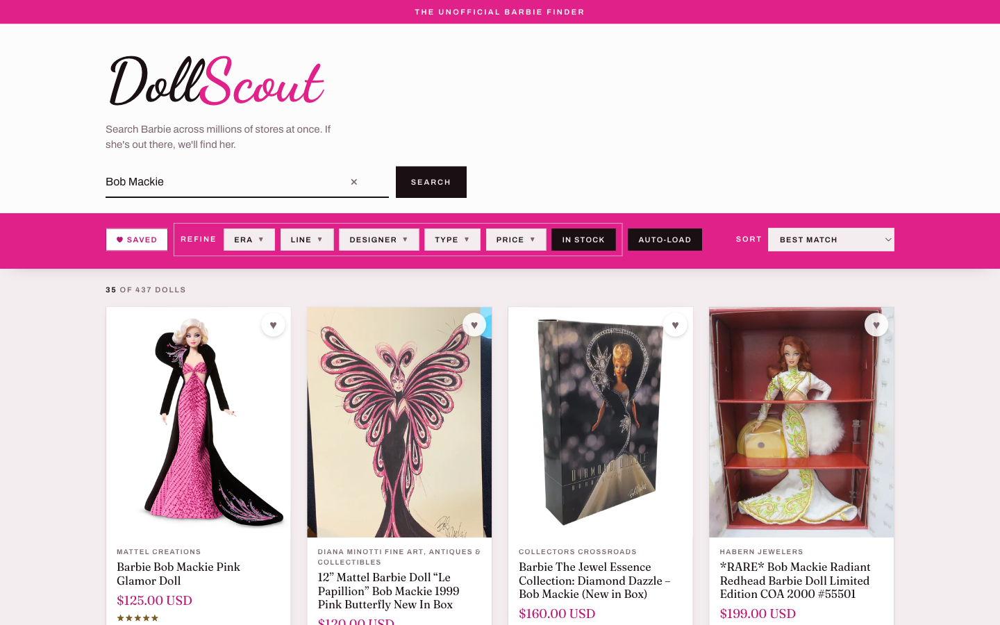
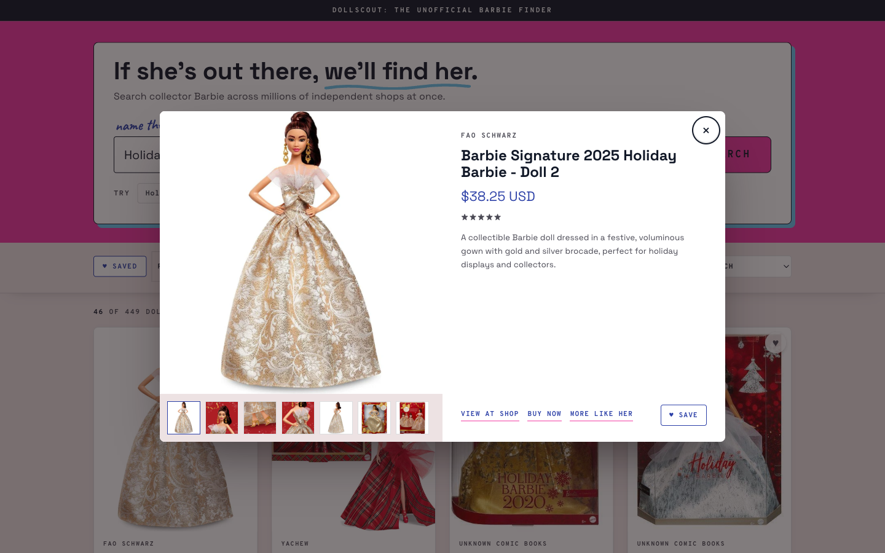
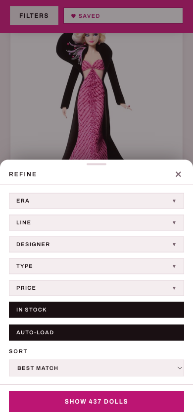

# Magpie

**Build a product finder for any hobby, on Shopify's Universal Commerce Protocol.**

Magpie is a boilerplate for hobby product-search sites: one Python file of engine, one
HTML file of UI, zero dependencies. It ships configured as
[**DollScout**](https://www.dollscout.com), a live collector-Barbie finder, so cloning
this template gives you a complete working demo. Point it at your own obsession
(vinyl, fountain pens, trading cards, diecast cars) by editing one config file: see
[RETARGETING.md](RETARGETING.md).

Like the bird, it hunts shiny things across the whole landscape and brings them back
to one nest.

**Live demo:** [dollscout.com](https://www.dollscout.com)



<p>
  
  
</p>

## Why this exists

**UCP is demand generation for Shopify stores.** Every result card a finder like this
shows is a free, high-intent referral to an independent merchant: the shopper arrived
already hunting for exactly what that store sells, and one click lands them on the
store's own product page. The merchants do nothing to participate. No integration, no
feed, no fees; their catalog is already in UCP the moment they're on Shopify.

Shopify's [Universal Commerce Protocol](https://www.shopify.com/ucp) exposes that
global catalog, spanning millions of independent stores, searchable with **no merchant
auth and no API tokens**. So a niche product finder is buildable by one person in a
weekend, and every new one someone builds opens a new demand channel for thousands of
stores at once. That's why this boilerplate is free: more finders means more demand
for everyone. Built by [Kurt Elster](https://ethercycle.com), a Shopify partner, as a
contribution to the community. A rising tide lifts all ships.

The model is search-and-referral only. Result cards link out to each merchant's own
product and buy-now pages. Magpie never builds carts, never takes payment, holds no
inventory.

## Sponsored results

DollScout has no sponsors: no seller pays for placement, and results are shown in
the order UCP returns them. The template still ships the disclosure mechanism, and
using it is the rule, not a suggestion: **if your deployment has a paid, affiliate,
or other material relationship with a seller, list them in `SPONSORED_SELLERS`
(`domain.py`) and their results get a visible "Sponsored" label** on every result
card and in quick view. Sponsorship never changes ranking or filtering; the label
is pure disclosure. Running a finder that takes money from sellers without labeling
their results is deceptive (and in most jurisdictions, illegal): don't strip this.

## Features

The engine is small but production-hardened (it runs dollscout.com):

- **UCP global catalog search** via the `ucp` CLI: query + taxonomy chips + price /
  in-stock / condition (New / Pre-owned, UCP `filters.condition`) filters, cursor
  pagination, "more like this" similarity search
- **In-memory TTL cache** (repeat searches ~780ms → ~0ms, LRU-capped, warmed at boot
  with your popular queries)
- **Rate limiting** (sliding window per IP) and a **process semaphore** so a traffic
  spike can't fork-bomb the box
- **SEO out of the box**: crawlable `/?q=` deep-links with server-injected per-query
  meta, sitemap of popular searches, robots.txt, canonical/OG/Twitter tags, JSON-LD
- **Security headers** on every response (CSP, nosniff, frame-deny, referrer policy)
- **Polished UI**: suggestion dropdown, typewriter placeholder, quick-view modal with
  gallery, localStorage wishlist, client-side sort, infinite scroll, mobile filter
  bottom-sheet, `prefers-reduced-motion` support
- **Observability**: `/api/stats` with cache hit rate, p50/p95 search latency, and
  reference-match hit rate
- **Reference match index (optional)**: drop three JSON files into `data/` and every
  result whose listing matches a canonical entry in your reference catalog gets a
  "matched: …" badge (see below)

## Quickstart

Requires Python 3.7+ and Node (for the `ucp` CLI). Nothing from PyPI, no build step.

```sh
npm install -g @shopify/ucp-cli@0.6.2
ucp profile init --name agent --activate   # local protocol metadata, no secrets
python3 app.py                             # http://127.0.0.1:8787
```

The profile init is required because the CLI refuses to run without an active local
profile; it contains no keys or credentials. Global catalog search needs no merchant
authorization at all.

> **Version note:** tested against `@shopify/ucp-cli@0.6.2`. UCP is pre-1.0; newer CLI
> versions may change the JSON shape that `normalize()` in `app.py` expects.

## How it works

```
browser (index.html) → /api/search → app.py builds UCP input
                                    → `ucp catalog search --input {...}`
                                    → normalize → JSON → photo grid
```

| File | What it is |
|---|---|
| `app.py` | The engine: HTTP server, cache, rate limiting, SEO routes, security headers, UCP subprocess glue. Domain-agnostic; you should never need to edit it. |
| `domain.py` | **The entire domain configuration.** Brand terms, query anchor, taxonomy chips, popular queries, site origin, meta templates. Retargeting starts here. |
| `index.html` | Single-file vanilla-JS UI. Brand copy is isolated in six fenced `BRAND BLOCK` regions. |
| `DESIGN.md` | Design system for the 2026-07 riso rebrand: tokens (with measured contrast), component rules, a11y acceptance criteria, QA checklist. Read before any visual change. |
| `privacy.html`, `terms.html` | DollScout's real legal pages. **Replace with your own** (see RETARGETING.md). |
| `og-image.png` | 1200×630 social share card. Replace with your own. |
| `Dockerfile`, `fly.toml` | Fly.io deployment (Node for the CLI + Python for the app in one image). |

Useful implementation details:

- Prices arrive in **minor units** with a currency (`3000` = `$30.00 USD`).
- Pagination is **cursor-based**, followed verbatim from `result.pagination.cursor`.
- UCP has **no server-side sort**, so sorting is client-side over the loaded set.
- A **relevance filter** (`domain.BRAND_TERMS`) drops results whose title and
  description both lack a brand marker; the **query anchor** (`domain.QUERY_ANCHOR`)
  keeps free-text searches on-topic in an all-of-ecommerce catalog; a
  **collab-brand exclusion list** (`domain.EXCLUDE_BRAND_TERMS`) drops licensed
  merch (Funko Pops, Hot Wheels, UNO decks...) that carries the brand name but
  isn't the collectible itself.

## Reference match index (optional)

If you maintain a structured catalog of the collectibles in your niche, the engine can
tag live results with the canonical entry they match — DollScout shows
`matched: 1988 Happy Holidays Barbie Doll #1703` on listings it recognizes.

Drop three JSON files into `data/` (path overridable via `MATCH_INDEX_DIR`); without
them the feature is silently off:

| File | Shape |
|---|---|
| `master.json` | `{id: {name, year, stock_number, ...}}` — one entry per canonical item |
| `stock-numbers.json` | `{normalized_stock: [ids]}` — digits zero-stripped, alpha uppercased |
| `aliases.json` | `{lowercased alias: [ids]}` — each alias should carry year + name |

Matching is deliberately precision-first: an alias must cover the listing **title**
(token-subset, word order free), and a stock number alone never matches — manufacturers
reuse stock numbers, so a stock hit also needs the record's year or identifying name
words in the listing text. Titles containing `domain.MATCH_NEGATIVE_TERMS` (ornaments,
mugs, posters... merchandise *about* an item) never get a badge. `/api/stats` reports
`match_rate` over cards served.

The catalog also powers **search autocomplete**: `/api/suggest` serves one entry per
canonical record (name + stock number as a hidden search alias), and the search box
merges them into its dropdown under a catalog group tag — typing a stock number like
`1703` surfaces the doll it belongs to.

The JSONs are gitignored (`data/*.json`) — DollScout's are generated from a private
database — but `fly deploy` ships them from the local directory context.

## Deploy (Fly.io)

The included `Dockerfile` and `fly.toml` run one always-on machine (no cold starts).

```sh
brew install flyctl && fly auth login
fly launch --no-deploy --copy-config --name YOUR-APP --org YOUR-ORG --region ord --yes
fly deploy --remote-only     # remote builder; no local Docker needed
fly scale count 1 --yes      # Fly's HA default is 2 machines

# custom domain
fly certs add yourdomain.com
fly certs add www.yourdomain.com
# then create the DNS records `fly certs` prints, and verify:
fly certs check yourdomain.com
```

Update `SITE_ORIGIN` and `REDIRECT_HOSTS` in `domain.py` to match your domain.

## Retargeting to your hobby

The whole point. Follow [RETARGETING.md](RETARGETING.md): edit `domain.py`, walk the
six fenced brand blocks in `index.html`, swap the legal pages and share image, deploy.

## Contributing

PRs welcome. The constraint is the point: keep the backend stdlib-only, keep the
frontend one file, keep the engine domain-agnostic (hobby-specific anything belongs
in `domain.py` or a brand block).

## License and credits

MIT. Built by [Kurt Elster](https://ethercycle.com), host of The Unofficial Shopify
Podcast. Functional inspiration: [bricks.stormdevs.com](https://bricks.stormdevs.com/).

The shipped DollScout configuration is independent and unofficial: not affiliated
with, endorsed by, or sponsored by Mattel. Barbie® is a registered trademark of
Mattel, Inc., used descriptively.
